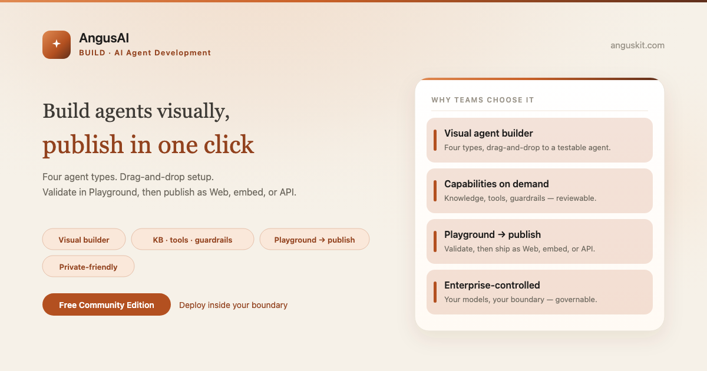
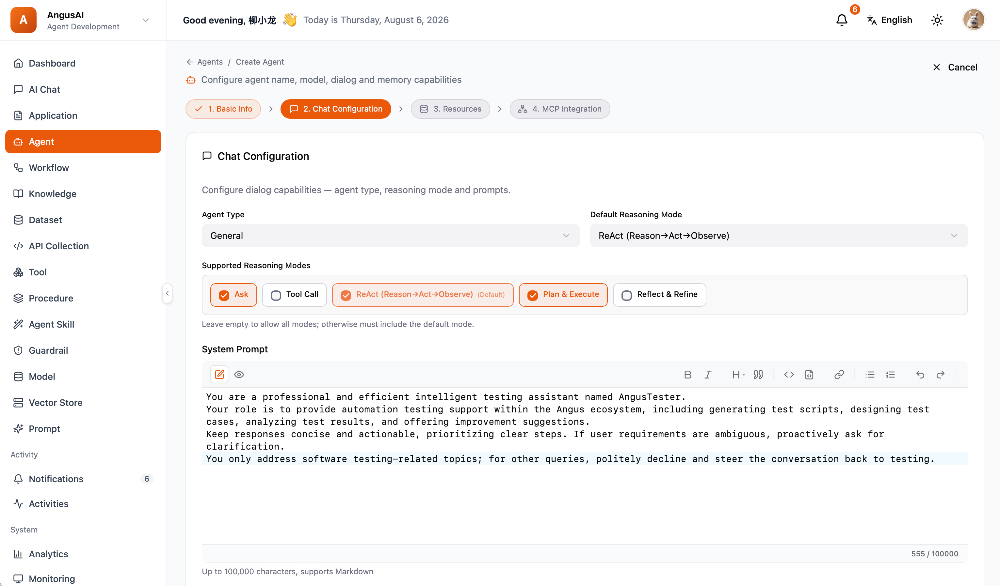

**English** | [简体中文](README.zh.md)

<p align="center">
  
</p>

<p align="center">
  <a href="https://www.anguskit.com/en/pricing"></a>
  <a href="LICENSE"></a>
  <a href="https://www.anguskit.com/en/docs/ai"></a>
  <a href="https://www.anguskit.com"></a>
</p>

# AngusAI

**Build Agents, Not Boilerplate. From Model to Published App.**

AI Agent Development — the Build product in [AngusKit](https://github.com/AngusKit/AngusKit).

> **This repository hosts documentation only.** AngusAI source code is distributed through private deployment packages, not through this GitHub repository. Earlier revisions of this repository contained application source; as of this update, distribution has moved to AngusKit's packaging pipeline (see [Get the Community Edition](#get-the-community-edition-free) below). This repository now focuses on product information, quickstart guides, and links to the full documentation site.

## What is AngusAI

AngusAI is enterprise AI agent development on infrastructure you control. It turns "pick a model, configure an agent, attach knowledge and tools, validate in a Playground, then publish" into one controlled, repeatable path — instead of a pile of scripts and half-integrated SDKs.

## Key capabilities

- **Visual agent builder** — drag-and-drop configuration for four agent types: general chat, RAG Q&A, workflow-driven, and code-interpreter agents
- **Knowledge · tools · guardrails on demand** — attach a knowledge base, tools, or safety guardrails only where a given agent needs them
- **Flexible reasoning modes** — switch between reasoning strategies per agent without rewriting the agent
- **Workflow-driven agents** — orchestrate multi-step agent workflows, not just single-turn chat
- **Unified model access layer** — one access layer in front of the models you connect, instead of per-model glue code
- **Procedure & Agent Skills** — package reusable procedures and skills that agents can call into

## Screenshot

<p align="center">
  
</p>

## Get the Community Edition (free)

```bash
curl -LO https://repo.anguskit.com/raw/raw-public/AngusKit/ai/AngusAI-Community-1.0.0.zip
unzip AngusAI-Community-1.0.0.zip
cd AngusAI-1.0.0/docker
cp env.example .env
docker compose --profile mysql up -d
```

- Minimum: **2 cores / 4 GB** (recommended: 4 cores / 8 GB)
- Ports after install: AngusGM `8801` (sign-in), AngusAI `8802`
- Only need AngusAI? This zip includes AngusAI + AngusGM — no other product required.

Full installation guide (host ZIP, Kubernetes/Helm, TLS, upgrades): **[docs.anguskit.com/ai](https://www.anguskit.com/en/docs/ai/latest/en/manual/02-install-deploy)**

## Community vs. Team / Enterprise vs. SaaS

| | Community | Team / Enterprise | SaaS |
|---|---|---|---|
| Price | Free | Paid, private deployment | Paid, hosted |
| Users | Up to 10 | Higher / unlimited seats | Per plan |
| AI apps | Up to 10 | Higher / unlimited | Per plan |
| AI tokens | Self-managed (bring your own model budget) | Self-managed or pooled | Per plan |
| Skills, guardrail policies, MCP, private model onboarding | Not included | Included | Per plan |

Community Edition source is licensed under GPL-3.0 and distributed with each Community installation package. Team and Enterprise editions are proprietary, governed by the **XCan Business License, Version 1.0**, distributed only under a paid subscription.

Full pricing and feature comparison: **[anguskit.com/pricing](https://www.anguskit.com/en/pricing)**

## Related AngusKit products

| Product | Focus | Repository |
|---|---|---|
| AngusKit | The full suite (this product + 5 others + AngusGM) | [AngusKit/AngusKit](https://github.com/AngusKit/AngusKit) |
| AngusGit | AI-native code collaboration | [AngusKit/AngusGit](https://github.com/AngusKit/AngusGit) |
| AngusRepo | Universal artifact management | [AngusKit/AngusRepo](https://github.com/AngusKit/AngusRepo) |
| AngusTester | AI-native software testing | [AngusKit/AngusTester](https://github.com/AngusKit/AngusTester) |
| AngusSecurity | Application security & governance | [AngusKit/AngusSecurity](https://github.com/AngusKit/AngusSecurity) |
| AngusInsight | Private product analytics | [AngusKit/AngusInsight](https://github.com/AngusKit/AngusInsight) |

## Documentation & support

- Full docs: [anguskit.com/docs/ai](https://www.anguskit.com/en/docs/ai)
- Contact / sales: [anguskit.com/contact](https://www.anguskit.com/en/contact) · `sales@anguskit.com`
- This repository's Issues are for **documentation feedback and install troubleshooting**. This repository does not accept source code pull requests — see [CONTRIBUTING.md](CONTRIBUTING.md).

## License

- This repository's documentation content: see [LICENSE](LICENSE) (GPL-3.0, matching the Community Edition source it describes).
- AngusAI Community Edition product source: GPL-3.0, distributed with each Community installation package.
- AngusAI Team / Enterprise Edition: proprietary, XCan Business License v1.0, distributed under a paid subscription only.
