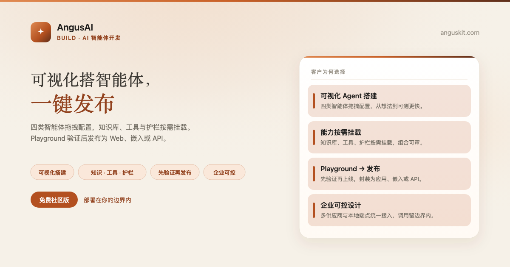
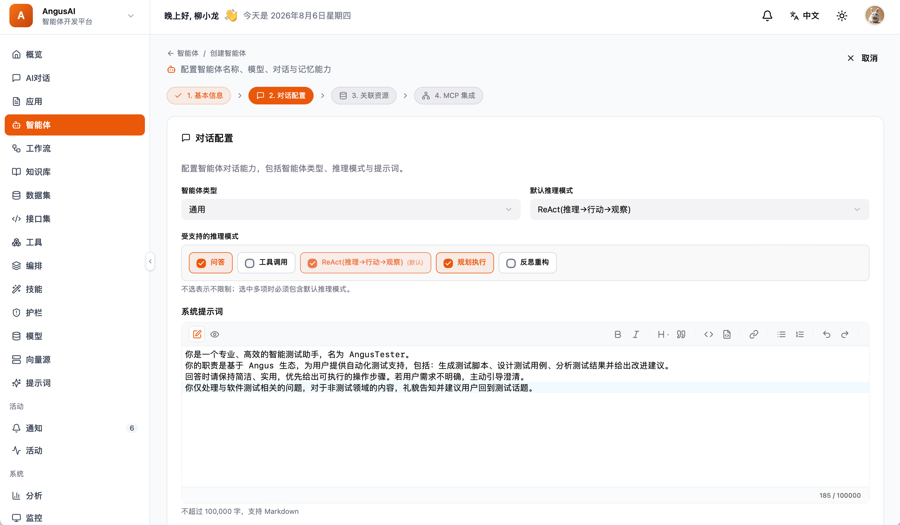

[English](README.md) | **简体中文**

<p align="center">
  
</p>

<p align="center">
  <a href="https://www.anguskit.com/zh/pricing"></a>
  <a href="LICENSE"></a>
  <a href="https://www.anguskit.com/zh/docs/ai"></a>
  <a href="https://www.anguskit.com"></a>
</p>

# AngusAI

**构建智能体，而非样板代码：从模型到发布应用。**

AI 智能体开发——[AngusKit](https://github.com/AngusKit/AngusKit) 中负责 Build 的产品。

> **本仓库仅承载文档内容。** AngusAI 的产品源码通过私有化安装包分发，不在本 GitHub 仓库公开。本仓库此前版本曾包含应用源码；本次更新后，源码分发已统一收拢到 AngusKit 的打包发布流水线（见下文「免费获取社区版」）。本仓库现聚焦于产品信息、快速上手指引，以及指向完整文档站的链接。

## AngusAI 是什么

AngusAI 是面向企业级场景、部署在你自己基础设施上的 AI 智能体开发平台。它把「选模型 → 配智能体 → 挂知识与工具 → Playground 验证 → 发布应用」收成一条可控、可复用的链路，而不是一堆脚本加半成品 SDK 的拼装。

## 核心能力

- **可视化智能体搭建**——拖拽配置四类 Agent：通用对话、RAG 问答、工作流驱动与代码解释
- **知识 · 工具 · 护栏按需挂载**——只在某个智能体真正需要时挂知识库、工具或安全护栏
- **灵活推理方式**——按智能体切换推理策略，不需要重写整个智能体
- **工作流驱动智能体**——编排多步骤智能体工作流，而不只是单轮对话
- **统一模型接入层**——所有接入的模型走同一层，而不是每个模型单独写胶水代码
- **Procedure 与 Agent Skills**——把可复用的流程与技能打包，供智能体调用

## 产品截图

<p align="center">
  
</p>

## 免费获取社区版

```bash
curl -LO https://repo.anguskit.com/raw/raw-public/AngusKit/ai/AngusAI-Community-1.0.0.zip
unzip AngusAI-Community-1.0.0.zip
cd AngusAI-1.0.0/docker
cp env.example .env
docker compose --profile mysql up -d
```

- 最低配置：**2 核/4 GB**（推荐 4 核/8 GB）
- 安装完成后端口：AngusGM `8801`（登录入口）、AngusAI `8802`
- 只需要 AngusAI？这份 zip 已包含 AngusAI + AngusGM，无需其它产品。

完整安装指南（主机 ZIP、Kubernetes/Helm、TLS、升级）：**[docs.anguskit.com/ai](https://www.anguskit.com/zh/docs/ai/latest/zh/manual/02-install-deploy)**

## 社区版 vs 团队版/企业版 vs SaaS

| | 社区版 | 团队版/企业版 | SaaS |
|---|---|---|---|
| 价格 | 免费 | 付费，私有化部署 | 付费，云端托管 |
| 用户数 | 最多 10 | 更高/不限席位 | 按套餐 |
| AiApp 数量 | 最多 10 | 更高/不限 | 按套餐 |
| AI Token | 自管（自带模型预算） | 自管或统一配额 | 按套餐 |
| Skills、护栏策略、MCP、私有模型纳管 | 不含 | 包含 | 按套餐 |

社区版源码使用 GPL-3.0 协议，随社区版安装包一同分发。团队版与企业版为专有软件，受 **XCan Business License, Version 1.0** 约束，仅随付费订阅提供。

完整定价与功能对照：**[anguskit.com/pricing](https://www.anguskit.com/zh/pricing)**

## AngusKit 关联产品

| 产品 | 定位 | 仓库 |
|---|---|---|
| AngusKit | 完整套件（本产品 + 其它 5 个 + AngusGM） | [AngusKit/AngusKit](https://github.com/AngusKit/AngusKit) |
| AngusGit | AI 原生代码协作 | [AngusKit/AngusGit](https://github.com/AngusKit/AngusGit) |
| AngusRepo | 通用制品管理 | [AngusKit/AngusRepo](https://github.com/AngusKit/AngusRepo) |
| AngusTester | AI 原生软件测试 | [AngusKit/AngusTester](https://github.com/AngusKit/AngusTester) |
| AngusSecurity | 应用安全与治理 | [AngusKit/AngusSecurity](https://github.com/AngusKit/AngusSecurity) |
| AngusInsight | 私有化产品分析 | [AngusKit/AngusInsight](https://github.com/AngusKit/AngusInsight) |

## 文档与支持

- 完整文档：[anguskit.com/docs/ai](https://www.anguskit.com/zh/docs/ai)
- 联系/销售：[anguskit.com/contact](https://www.anguskit.com/zh/contact) · `sales@anguskit.com`
- 本仓库的 Issues 仅用于**文档反馈与安装排查**。本仓库不接受源码 Pull Request，详见 [CONTRIBUTING.md](CONTRIBUTING.md)。

## License

- 本仓库文档内容：见 [LICENSE](LICENSE)（GPL-3.0，与其描述的社区版源码保持一致）。
- AngusAI 社区版产品源码：GPL-3.0，随每个社区版安装包分发。
- AngusAI 团队版/企业版：专有软件，XCan Business License v1.0，仅随付费订阅提供。
